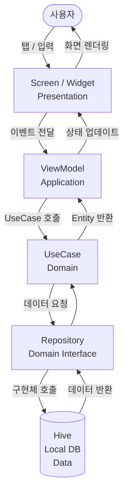

# Architecture

## 앱 목적

대학생이 시간표, 학사일정, 결석, 학점, 과제 메모를 하나의 앱에서 관리할 수 있도록 돕는 올인원 학사 관리 앱.

---

## 기술 스택

| 항목 | 선택 |
|---|---|
| 플랫폼 | Flutter (Dart) |
| 아키텍처 | Layered Architecture + MVVM |
| 상태관리 | Riverpod |
| 로컬 저장소 | Hive |
| 참고 ADR | ADR-0001-platform-selection.md |

---

## 레이어 구조

본 프로젝트는 4개의 레이어로 구성된다.
각 레이어는 아래 방향으로만 의존하며, 위 레이어를 직접 참조하지 않는다.

```
Presentation  →  Application  →  Domain  →  Data
   (화면)         (ViewModel)     (규칙)      (저장)
```

### Presentation (화면)
사용자가 직접 보는 UI 화면. Flutter Widget으로 구성된다.
ViewModel의 상태를 구독하고, 사용자 입력을 ViewModel로 전달한다.

### Application (ViewModel)
화면과 도메인 사이의 중간 레이어. Riverpod Provider로 구현한다.
UI 상태를 보관하고, UseCase를 호출하여 결과를 화면에 전달한다.

### Domain (비즈니스 규칙)
앱의 핵심 로직이 위치한다. Flutter나 Hive에 의존하지 않는 순수 Dart 코드.
Entity(데이터 구조)와 UseCase(규칙 계산)로 구성된다.

### Data (저장소)
실제 데이터를 읽고 쓰는 레이어. Hive 로컬 DB를 사용한다.
Repository 패턴으로 구현하여 Domain이 저장 방식에 의존하지 않도록 한다.

---

## 전체 데이터 흐름



---

## 화면별 데이터 흐름 요약

| 화면 | ViewModel | UseCase | Entity |
|---|---|---|---|
| 홈 | HomeViewModel | GetTodaySchedule, GetUpcomingTasks | Course, Task |
| 시간표 | TimetableViewModel | AddCourse, DeleteCourse | Course |
| 학사일정 | CalendarViewModel | AddSchedule, DeleteSchedule | AcademicSchedule |
| 결석 계산기 | AttendanceViewModel | CheckAttendance, CalculateLimit | Course, Attendance |
| 학점 계산기 | GradeViewModel | CalculateGPA | Course, Grade |
| 과제 메모 | TaskViewModel | AddTask, CompleteTask, GetUpcomingTasks | Task |

---

## 디렉토리 구조

```
lib/
├── main.dart
├── presentation/              # 화면 (Widget)
│   ├── home/
│   │   └── home_screen.dart
│   ├── timetable/
│   │   ├── timetable_screen.dart
│   │   └── widgets/
│   ├── academic_calendar/
│   │   ├── calendar_screen.dart
│   │   └── widgets/
│   ├── attendance/
│   │   ├── attendance_screen.dart
│   │   └── widgets/
│   ├── grade/
│   │   ├── grade_screen.dart
│   │   └── widgets/
│   └── task/
│       ├── task_screen.dart
│       └── widgets/
│
├── application/               # ViewModel (Riverpod Provider)
│   ├── home_viewmodel.dart
│   ├── timetable_viewmodel.dart
│   ├── calendar_viewmodel.dart
│   ├── attendance_viewmodel.dart
│   ├── grade_viewmodel.dart
│   └── task_viewmodel.dart
│
├── domain/                    # 비즈니스 규칙
│   ├── entities/
│   │   ├── course.dart          # 과목 정보
│   │   ├── academic_schedule.dart  # 학사일정
│   │   ├── attendance.dart      # 출결 기록
│   │   ├── grade.dart           # 성적
│   │   └── task.dart            # 과제 메모
│   ├── usecases/
│   │   ├── calculate_attendance_limit.dart  # 결석 한도 계산
│   │   ├── calculate_gpa.dart               # GPA 계산
│   │   └── get_upcoming_tasks.dart          # 마감 임박 과제 조회
│   └── repositories/          # 인터페이스 (추상 클래스)
│       ├── course_repository.dart
│       ├── schedule_repository.dart
│       ├── attendance_repository.dart
│       ├── grade_repository.dart
│       └── task_repository.dart
│
└── data/                      # 저장소 구현체
    └── repositories/
        ├── hive_course_repository.dart
        ├── hive_schedule_repository.dart
        ├── hive_attendance_repository.dart
        ├── hive_grade_repository.dart
        └── hive_task_repository.dart
```

---

## 핵심 비즈니스 규칙 (Domain)

### 결석 한도 계산
```
결석 한도 = 총 수업 횟수 × 0.25
현재 결석 횟수 >= 결석 한도  →  위험 경고 표시
현재 결석 횟수 >= 결석 한도 × 0.75  →  주의 경고 표시
```

### GPA 계산
```
각 과목 환산점수 = 점수 → 등급(A+, A, B+...) → 환산값(4.5, 4.0, 3.5...)
GPA = Σ(환산값 × 학점 수) ÷ Σ(학점 수)
```

### 마감 임박 과제 조회
```
오늘 기준 3일 이내 마감인 미완료 과제 → 홈 화면 상단 강조 표시
```

---

## 새 기능 추가 시 파일 위치 규칙

| 추가할 것 | 위치 |
|---|---|
| 새 화면 | `presentation/[기능명]/[기능명]_screen.dart` |
| 화면 내 재사용 위젯 | `presentation/[기능명]/widgets/` |
| 상태 관리 | `application/[기능명]_viewmodel.dart` |
| 데이터 구조 | `domain/entities/[이름].dart` |
| 비즈니스 규칙 | `domain/usecases/[동작명].dart` |
| 저장소 인터페이스 | `domain/repositories/[이름]_repository.dart` |
| 저장소 구현 | `data/repositories/hive_[이름]_repository.dart` |

---

## 미결정 설계 이슈

- [ ] 앱 아이콘 및 스플래시 화면 디자인
- [ ] 시간표 색상 테마 커스터마이징 여부
- [ ] 학사일정 기본 데이터 제공 여부 (하드코딩 vs 직접 입력)
- [ ] 과제 완료 후 보관 기간 (무기한 / 30일 후 자동 삭제)
- [ ] 다크모드 지원 여부

---

## 관련 문서

- `docs/ADR-0001-platform-selection.md` — 플랫폼 선택 근거
- `docs/setup.md` — 환경 설정 가이드
